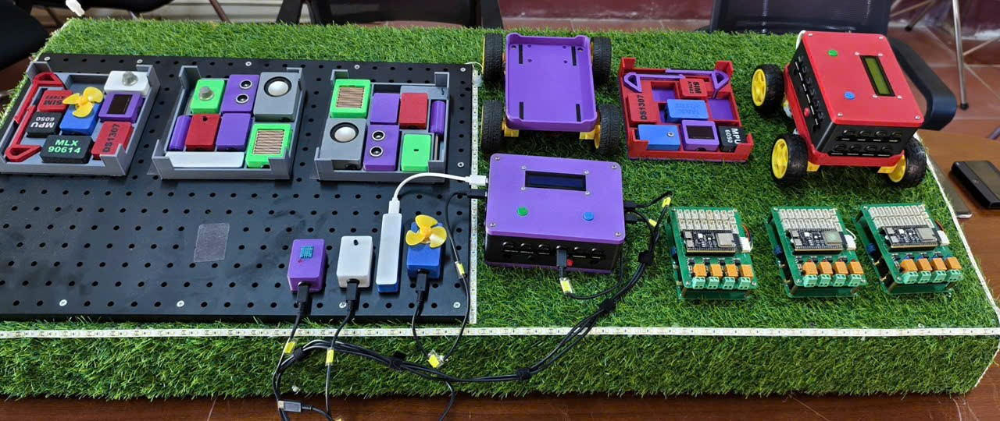
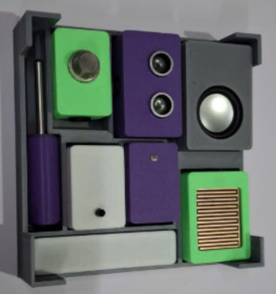
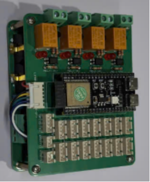
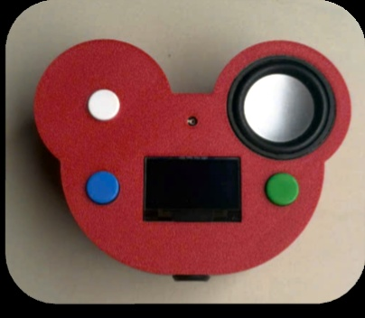

# EduMaker STEMKit

**Award:** 3rd Prize, SV.STARTUP national entrepreneurship competition.

**Role:** Specified the board requirements (ESP32 S3, labeled sensor ports) and had a manufacturer turn that into an actual PCB. Milled the board on a desktop CNC with my teacher's help, since I wasn't experienced with that process myself. Designed and 3D printed the casing myself. Wrote the code and designed both sample projects (the remote control car and the smart home). Built and trained the companion chatbot myself.

I built EduMaker STEMKit to help students learn programming and robotics through hands-on building instead of just theory. Instead of one fixed circuit, I designed it as a set of snap together blocks (sensor, controller, display, AI unit) that combine into different builds. I also built two sample projects, a remote control car and a smart home, so students have ready-made projects to learn from.

## What it is

I made two versions for two different stages of learning:

| Version | What it looks like | Who it's for |
|---|---|---|
| **Starter** | Bare board, wires exposed | Students still learning the hardware itself: wiring, pin layout, raw code |
| **Comfort** | Same board, 3D printed case | Students who already know the hardware and want to focus on the software |

*What the sensor blocks look like taken apart*

## Hardware

| Component | Function |
|---|---|
| ESP32 S3 | Main controller (center of the board) |
| DHT11 | Temperature and humidity |
| MLX90614 | Infrared (contactless) temperature |
| Heart rate sensor | Pulse sensing |
| MPU6050 | Accelerometer / gyroscope |
| RTC module | Real time clock |
| Analog sensor port | General purpose analog input |
| RGB LED | Status/color feedback |
| OLED / LCD | Text and graphic display |
| Bluetooth module | Short range wireless control |
| SIM/GSM module | Cellular connectivity |

I couldn't lay out the circuit board myself, so I specified what it needed (an ESP32 S3 at the center, labeled ports for sensors like gas, fire, and heart rate) and a manufacturer turned that into the actual board above.

Full pin mapping for every port on the board: [`docs/pin-mapping.md`](docs/pin-mapping.md).

## Projects

### Remote control car

Controlled over Bluetooth from the companion Android app (see Mobile app below). The app sends single character commands (`G` forward, `B` back, `L` left, `R` right, `S` stop) over a serial connection, and the board turns those into motor signals through the L298 driver.

Code: [`remote-control-car.ino`](firmware/projects/remote-control-car/remote-control-car.ino), [`functions.ino`](firmware/projects/remote-control-car/functions.ino)

### Smart home

Built on Blynk, so it can be monitored and controlled remotely through the Blynk app instead of only from a local switch. Reads gas and fire sensors, a DHT11 for temperature/humidity, and shows readings on an LCD. Controls a lamp and a fan, and sounds a buzzer if it detects gas or fire.

Code: [`smart-home.ino`](firmware/projects/smart-home/smart-home.ino)

## AI Chatbot

A board like Arduino has years of forum threads to fall back on when something breaks. A brand new kit has none of that, so I built a chatbot to cover that gap myself.

* I built it on an existing AI model (through the Xiaozhi AI platform, running DeepSeek V4) rather than training one from scratch.
* I trained it on data specific to this board (every port, every pin, what each one is normally used for) so it can actually help with *this* kit instead of answering generic embedded systems questions. The full reference data is in [`docs/pin-mapping.md`](docs/pin-mapping.md).
* It's tuned to understand users speaking in a Mekong Delta / Southern Vietnamese accent, since that's who the kit is built for.
* It runs as a voice assistant, so a student can just ask it something out loud.

## Repository layout

| Folder | Contents |
|---|---|
| `hardware/pcb/` | Proteus source for the top and bottom boards, plus exported Gerber/drill files (`gerber-export.zip`) ready for manufacturing |
| `hardware/cnc/` | G-code toolpaths (`.tap`) I used to mill the board on a desktop CNC |
| `enclosure/` | SketchUp source for the 3D printed case and sensor mounts |
| `firmware/module-tests/` | One minimal Arduino sketch per module, to confirm a single sensor works before combining it into a build |
| `firmware/projects/` | Integrated builds: the remote control car and the Blynk based smart home |
| `mobile-app/` | Companion Android app for the car (`.aia` source + installable `.apk`) |
| `docs/pin-mapping.md` | Full port/pin reference for the board, also used as the chatbot's training data |

## Getting started

1. Want to test a single module? Open any sketch in `firmware/module-tests/<module-name>/`.
2. Want to see how modules combine into a real build? Look at `firmware/projects/`.
3. Want to fabricate your own board? `hardware/pcb/` has the Proteus source; `gerber-export.zip` in each board folder is ready to send to a manufacturer.
4. Want to print your own case? Case files are in `enclosure/` (SketchUp).

## Future development

I want to keep improving the training data based on real feedback: once the kit is actually in students' hands (especially if it starts selling to more schools), I can see what they actually ask and where they get stuck, and update the prompt from that instead of guessing.

I also want to keep building more sample projects, so students have a wider range of ready-made builds to learn from beyond the car and the smart home.
